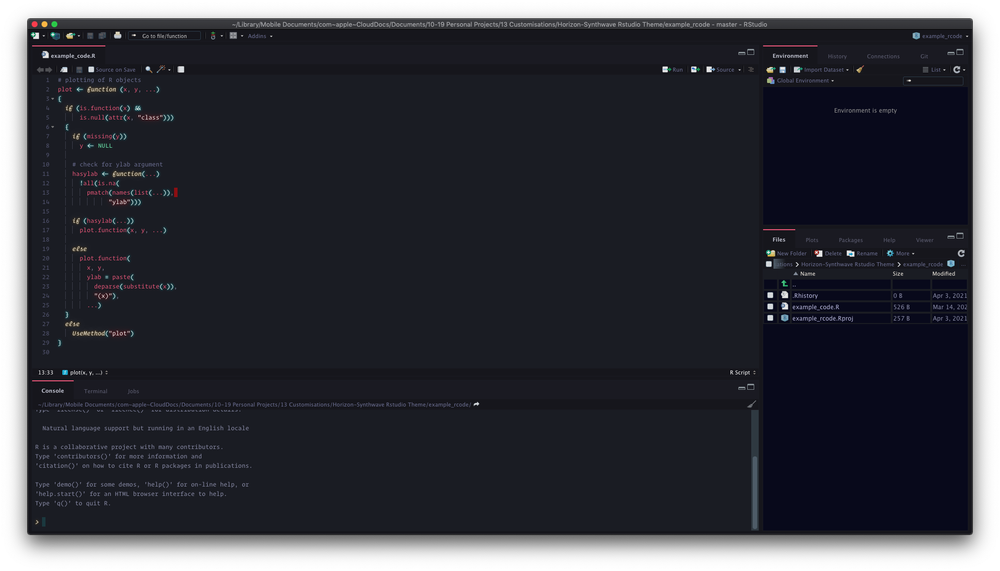

# Horizon-Synthwave Rstudio Theme

I needed a dark Rstudio theme that didn't look like an early 2000s application,
but like my code to really glow. So I mashed together two Rstudio themes that I
liked to keep the best of both. I have mixed here the UI elements from
the excellent Horizon-Dark theme, as well as the text settings from the
Synthwave85 theme. I did modify the background color for the code blocks to
make it blacker.

## Screenshot



## Source Themes

The Original Themes were:

- [Synthwave85](https://github.com/jnolis/synthwave85)

- [horizon-dark](https://github.com/gadenbuie/rsthemes)

## Installation

The [rsthemes](https://github.com/gadenbuie/rsthemes) package should be setup
and the default themes installed.

```{r}
devtools::install_github("gadenbuie/rsthemes")
rsthemes::install_rsthemes()
```

Download the raw theme file and open Rstudio.

In the settings menu, select `Appearance -> Add` and select the downloaded
theme
